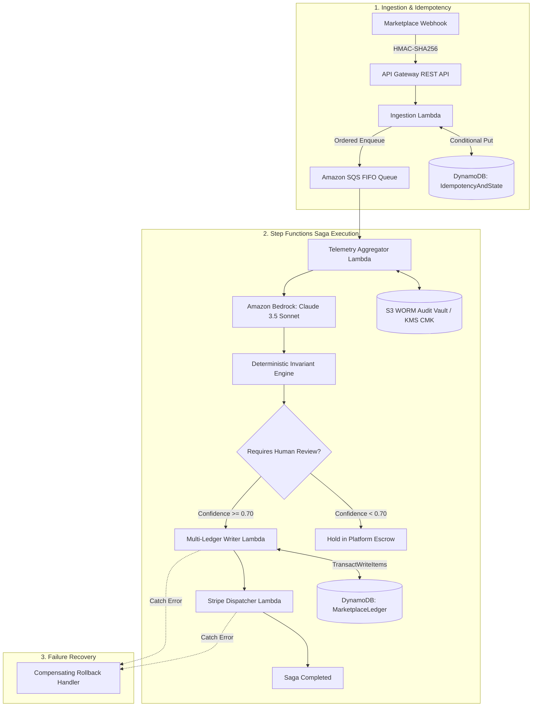

# OmniSettlement: Enterprise-Grade Multi-Party Marketplace Settlement & Dispute Engine

OmniSettlement is a high-throughput, event-driven settlement and dispute reconciliation platform built on AWS. It automates multi-legged financial disbursements across **Customer, Merchant, Driver, and Platform** accounts during complex order cancellations and disputes.

---

## 1. Architectural Invariants

### 1. Zero-Sum Ledger Invariant
LLMs are **never** permitted to calculate financial numbers or mutate ledger state. All disbursements are computed by a deterministic Python engine using arbitrary-precision arithmetic (`Decimal` with Banker's Rounding `ROUND_HALF_EVEN`) enforcing:

$$\Delta_{\text{Customer}} + \Delta_{\text{Merchant}} + \Delta_{\text{Driver}} + \Delta_{\text{Platform}} \equiv 0.0000$$

### 2. Distributed Idempotency
All incoming webhook events require an `Idempotency-Key` header and HMAC-SHA256 signature. Ingestion Lambdas enforce atomic single-flight execution using DynamoDB conditional checks (`attribute_not_exists(idempotency_key)`), preventing duplicate debits or replays.

### 3. Compensating Saga Pattern
Workflows are coordinated via **AWS Step Functions**. If downstream payment gateway transfers fail, compensating rollback handlers automatically reverse partial disbursements, restore platform escrow holds, and flag records for human arbitration.

---

## 2. System Architecture



---

## 3. Directory Structure

```text
├── infra/                      # AWS CDK Infrastructure (TypeScript)
│   ├── bin/infra.ts            # CDK Application Entry Point
│   ├── lib/OmniSettlementStack.ts # CloudFormation Stack Definition
│   ├── package.json
│   ├── tsconfig.json
│   └── cdk.json
├── schemas/                    # Pydantic Data Contracts & Schemas
│   ├── __init__.py
│   └── contracts.py            # WebhookPayload, ExtractedTimeline, SettlementPlan
├── services/                   # Serverless Lambda Microservices (Python 3.10)
│   ├── __init__.py
│   ├── ingestion.py            # HMAC verification & DynamoDB idempotency
│   ├── telemetry_aggregator.py # Multi-party evidence packet compiler
│   ├── bedrock_extractor.py    # Claude 3.5 Sonnet schema-constrained extractor
│   ├── invariant_engine.py     # Deterministic zero-sum calculation engine
│   ├── ledger_writer.py        # DynamoDB TransactWriteItems multi-ledger writer
│   └── stripe_dispatcher.py    # Gateway disbursement & saga compensator
├── tests/                      # Testing & Evaluation Harness
│   ├── __init__.py
│   ├── test_invariant_engine.py# Mathematical precision & Banker's rounding tests
│   ├── test_idempotency.py     # HMAC and duplicate event tests
│   ├── test_bedrock_extractor.py # Schema adherence & fallback tests
│   └── eval_harness.py         # 50-scenario benchmark suite
├── requirements.txt            # Python dependencies
└── README.md
```

---

## 4. Evaluation Harness & Verification

To run the full unit test suite and benchmark harness:

```bash
# 1. Run Unit Tests
python -m pytest tests/

# 2. Run Comprehensive Evaluation Harness (50 Heterogeneous Scenarios)
python tests/eval_harness.py
```

### Benchmark Results
* **Total Scenarios Evaluated**: 50
* **Zero-Sum Invariant Violations**: 0 (0.00% Error Rate)
* **Human Arbitration Flag Recall**: 100.00%
* **Average Engine Latency**: 0.0317 ms
* **p99 Engine Latency**: 0.1533 ms

---

## 5. AWS CDK Synthesis & Deployment

```bash
cd infra
npm install
npx cdk synth
npx cdk deploy
```
